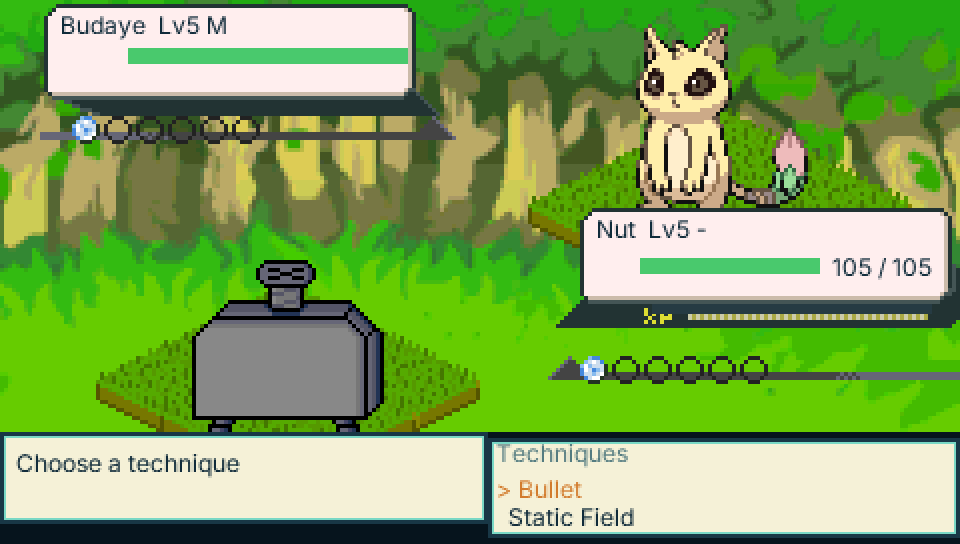
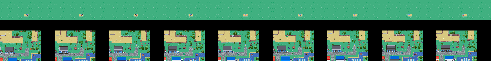
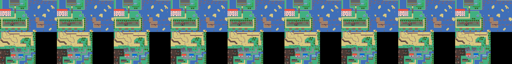
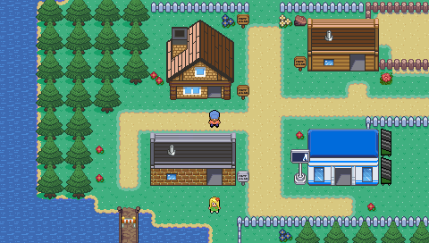
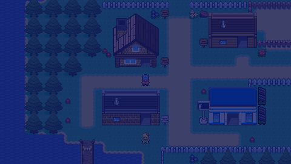

# Pocket Tuxemon

[Tuxemon](https://github.com/Tuxemon/Tuxemon)'s world — its maps, events,
characters and dialogue — imported into
[Pocket RPG Kit](https://github.com/lfkdsk/pocketjs-rpgkit) and played on
[PocketJS](https://github.com/pocket-nexus/pocketjs) (desktop, web, PSP).

Work in progress. The importer reads a pinned Tuxemon checkout
(`bun run fetch:tuxemon`, commit `9e6258ff`) and writes
`rpgkit-project/v1` documents and baked art into this repository.

<p align="center">
  
  
</p>

## Status

The per-system checklist is in [docs/status.md](docs/status.md); the
summary:

- **World (P1, playable):** all 263 Tuxemon maps and their 4,572 events are
  imported automatically — terrain with one-way ledges, animated tiles, tall
  NPC walkers, dialogue, cutscene routes and map transfers. The Spyder
  campaign plays from the bedroom through Paper Town, Cotton Town, City Park,
  the north end of Route 3, Route 4 and Flower City to the Captain's return
  in the Mansion and on through Candy Town, the hospital cure and Omnichannel
  to the Radio Tower broadcast — 185,802 frames at 60 Hz for the full
  mainline, driven by
  deterministic autoplay tapes — and every imported input lock is executed
  to its unlock. On the 67 placed outdoor maps, the streamed renderer paints
  neighbouring ground, upper layers and animated tiles across authored seams,
  with map, texture-shard and NPC-art caches bounded to the current world
  working set. The project now opts into `seamless-v1`: 253 of the 258
  coordinate-preserving outdoor openings cross atomically in eight ticks with
  no fade. Portal-only, gap, rejected, indoor, faint and story transfers keep
  their legacy transition, and neighbouring-map NPC preview remains planned.
- **Battles (P2, complete):** the battle database and 590 battle
  textures are imported from Tuxemon's YAML, and `battle/` is a pure
  reducer whose results match Tuxemon's own Python engine on 8,560 recorded
  battles; monsters spawn draw-for-draw like Tuxemon's. The mainline is
  played for real end to end: the autoplay tapes fight 188 real battles
  (107 on the Route 3 mainline — 22 trainer + 85 wild — 14 on the
  Captain-return continuation — 10 trainer + 4 wild — and 54 on the way to
  the hospital cure — 50 trainer + 4 wild — and 13 more trainers through
  Omnichannel and the Radio Tower), and every trainer
  battle enters Battle Processing and ends `won` with its `battle_outcome`
  written back. The frozen 31-minute 60 Hz tape (110,866 frames / 30 min 48 s)
  replays byte-identical at 60, 30 and 20 Hz, and both failure paths are
  verified — the first loss against Billie, and a later loss on Route 3
  with the faint-point teleport, the heal-before-leaving block and the
  nurse recovery. Double battles, capture, items, swapping and levelling
  are live. The battle scene uses the imported Tuxemon backgrounds,
  islands, trainers, monsters, HUD frames, status/party icons and
  technique strips; every slide, hit, HP/XP tween, faint and capture shake
  is driven by the reducer's rewindable reference tick rather than a wall
  clock. The 590 images are indexed single-tile entries, loaded on demand
  through one battle cache and detached/freed on exit.
- **Names and Tuxepedia:** the authored player- and monster-name prompts use
  saved, rewindable game scenes. Seen/caught status is persistent and monotonic;
  journal previews and the normal browser render monster details through the
  same indexed, lazily loaded battle-image shards as combat.
- **Performance:** 260 compact map shards plus 3 canonical JSON shards use
  5,348,762 B instead of 10,270,416 B for all-canonical JSON. The three
  event-heavy maps cross a 128 KiB compact-decode cap, trading a small amount
  of storage for bounded first-visit latency on QuickJS. Indexed battle art
  plus its lazy database occupies 3,516,960 B in the pak. The current bilingual
  Web game pak is 86,848,752 B, including English and Chinese content, CJK font
  atlases, all content-resolvable audio, its attribution list and demo data; the
  desktop pak is 74,097,552 B. Before compact
  maps and indexed battle art, an earlier English-only Web build was
  66,791,328 B. The all-image battle encoding is
  2,206,076 B on disk and 13,394,688 B if every PSM_T8 texture were decoded,
  but only the active battle working set is resident.

  On the desktop QuickJS host, the current fixed-CPU matrix starts five fresh
  processes per route and viewport. Under one-minute loads of 1.30–4.89, all
  completed GB6, hospital-to-radio J3 and two-pass outdoor-cache production
  frames stayed below the stricter 45 ms line; the worst QuickJS-plus-core CPU
  frame was 42.287 ms. That is 0.199 ms below the previous five-run maximum and
  0.371 ms above its three-run review maximum. Every cache-walk sample had zero
  second-pass native-node or texture growth. Shared-host startup remains
  unreliable: the unchanged 250 ms gate rejected both five-process GB6 groups
  before replay and four of five J3 480×272 starts, so separately labelled
  500 ms startup diagnostics supplied those production-frame distributions
  without being counted as startup passes. The Chinese smoke tape also stayed
  below 50 ms in three diagnostic processes at each viewport (49.258 ms worst),
  although it did not always meet the stricter 45 ms line. Cold/hot medians,
  exact startup counts, load ranges, bundle identities and attribution are in
  [the verification guide](docs/verification.md#the-quickjs-benches).
- **Import coverage:** 89.3% of Tuxemon action uses and 96.3% of condition
  uses map natively to kit commands; 97.3% / 96.7% are executable (native,
  degraded, or a deliberate placeholder). The full per-type breakdown is in
  [reports/G1-coverage.md](reports/G1-coverage.md).
- **Day/night:** a saved, rewindable calendar drives Tuxemon's time conditions
  and its real day/night event pages. Fresh games start from one local-clock
  sample; tests and journey replays pin 09:00. Dawn, day, dusk and night use a
  smoothly changing named tint, while weather has its own deterministic RNG
  and transition deadline.

## Screenshots

The world renders pixel-for-pixel like Tuxemon's own maps. Left: this
runtime; right: an independent render of the same Tuxemon TMX map, used as
the reference in the terrain tests (0 differing pixels).


The first trainer battle, played for real: Billie's Budaye against Nut,
with sprites, HUD and backgrounds imported from Tuxemon and the rules
running bit-exact with Tuxemon's own engine. The lower band is Pocket RPG
Kit's state-driven command/list UI; the screenshot is a nearest-neighbour
2× capture of its 480×272 logical scene.

<p align="center">
  
</p>

The mainline journey, played by the deterministic autoplay tape: Cotton Town
(left) and the north end of Route 3 (right), two frames from the Route 3
mainline.

<p align="center">
  
  
</p>

Safe outdoor openings now scroll directly into the neighbouring map. The two
contact sheets below show all eight crossing phases plus the landing frame for
a horizontal and vertical seam; each row is also captured at both supported
viewports in [docs/screenshots/world-seam](docs/screenshots/world-seam/).

<p align="center">
  
  
</p>

The same Paper Town checkpoint at fixed 09:00 and 21:00 starts. The night
frame is intentionally darker and bluer; the golden test verifies those
properties from the decoded pixels as well as pinning the PNG bytes.

<p align="center">
  
  
</p>

## Play it

- **In a browser:** <https://lfkdsk.github.io/pocketjs-tuxemon/pocket-tuxemon/>
  (deployed from `main` after CI has played the opening browser journey on it).
- **From a CI run:** every push builds the web version. Open the
  latest [CI run](../../actions/workflows/ci.yml), download the `web-site`
  artifact, unzip it and serve the folder, e.g.
  `python3 -m http.server -d web-site 8000`, then open
  <http://localhost:8000/pocket-tuxemon/>.
- **Locally:** `bun run web`, then serve `dist/web` the same way; or
  `bun run desktop` for the desktop host.
- **Keys:** arrows walk, `A`/`Z`/`Enter` talks and confirms, `B`/`Esc` goes back,
  `Space` (START) opens the save menu, `L`/`Q` rewinds three seconds.

### Saving and loading

Press START (`Space` in the browser and on desktop) to open the save menu. The
world is paused while the menu is open.

- **Save to slot / Load from slot:** three slots. The desktop build writes
  `save/slot-1.json` … `save/slot-3.json` in the app's data folder. The browser
  build keeps them in the page's local storage.
- **Save code (export) / Load code (import):** the same save as URL-safe text,
  paged on screen. Hosts with no file system or browser storage (PSP) have only
  these two rows. Codes are compressed, but still a few thousand characters
  (3,209–5,297 at the `verify:save` points; 3,657 in the documented screenshot),
  so they suit copying between tools more than typing on the on-screen
  keyboard. Additive project-schema upgrades change the encoded text, but the
  runtime accepts compatible older schema identities and rewrites the next
  save under the current identity.

You can save only when nothing is in progress. During dialogue, a battle, a
scripted scene, a map change or a step, the menu says why it can't save.
Damaged saves, saves from another build of the game and empty slots show an
error and leave the game as it was. A load picks up exactly where the save was
made; `bun run verify:save` checks this at five points along the GB6 mainline.

Screens: [menu](docs/screenshots/save/save-menu.480x272.png),
[saved](docs/screenshots/save/save-done.480x272.png),
[refused](docs/screenshots/save/save-refused.480x272.png),
[loaded](docs/screenshots/save/save-loaded.480x272.png),
[save code](docs/screenshots/save/save-code-export.480x272.png)
(960×544 versions alongside; `bun run screens:save` re-renders them from the
built game).

CI also plays the 3,990-frame opening journey — bedroom, Paper Town, the
first battle, Route 1 — in headless Chrome against the built site
(`bun tools/verify-web-journey.ts`) and checks every checkpoint's state and
pixels against the goldens.

## Chinese version (中文版)

The game ships with a Simplified Chinese (zh_CN) build alongside English.
Text is resolved from the reviewed corrections in
`l10n/zh_CN/overrides.po`, then the upstream Tuxemon zh_CN community catalog,
the project's machine-translated supplement (`l10n/zh_CN/supplement.po`), two
importer labels, and finally the English source. Every one of the 5,370 English
strings has a Chinese rendering. The complete 2,098-entry upstream review is
recorded in `l10n/zh_CN/upstream-review.jsonl`; corrections retain their review
category, reason and the exact English source snapshot. Punctuation is
normalized to Chinese convention next to CJK text. The Noto Sans CJK subset
covering exactly the characters the Chinese build uses is baked into the font
atlases at build time.

- **Web:** open the player with `?lang=zh`
  (<https://lfkdsk.github.io/pocketjs-tuxemon/pocket-tuxemon/?lang=zh>), or
  press **R** in the game to open the language switcher. The choice is
  remembered in the browser, and the page reloads without the `lang`
  parameter so the stored choice wins on the next boot (priority: URL
  parameter > stored choice > English).
- **Desktop:** `bun run desktop -- --lang zh` (or `--lang en`). The in-game
  **R** switcher writes the choice to the app's data folder and asks for a
  restart.
- **Default:** English. The Chinese project supplies all 57 kit-owned
  interface strings: button hints, shop chrome, save pages, name input and
  its on-screen keyboard actions, demo chrome and errors, the event-error
  screen, and battle HP values. Missing future kit keys fail the importer
  instead of silently falling back to English. Game content — dialogue,
  choices, items, monsters, moves, battle menus, storage and daycare scenes
  — uses the separate Chinese catalog described above.

Saves record the language they were written with. Loading a save from the
other language shows a bilingual "LANGUAGE MISMATCH / 语言不匹配" prompt
(which language the save is in, how to switch) before any content check,
instead of an "another build" error. The demo menu (SELECT) remains disabled
in ordinary Chinese launches because its journey tape and chapter-row titles
were authored in English. Its kit-owned menu chrome is translated and covered
by the production visual fixture, ready for a future Chinese tape. The Chinese
opening has its own short smoke tape (`data/zh-smoke-journey.json`),
replayed in headless Chrome by `bun run verify:web:zh`, which renders the
expected text from the baked font atlas and matches its glyph mask against
the screenshot (dialog lines, battle prompt and command labels), asserts
strict catalog-exact pagination, and runs a mutation suite
(`tools/verify-web-zh-mutants.ts`) proving each assertion catches the
regression it targets.
`bun run check:l10n` validates every catalog layer, correction annotation,
placeholder and escaped newline, and enforces the glossary against the final
merged text (with reasoned, key-specific exceptions). `bun run check:cjk`
verifies glyph subset coverage. `bun test tests/ui-text-zh-visual.test.ts`
boots the production bundle and pins save, keyboard, demo, shop, button-hint,
event-error and battle-status frames at 480×272 and 960×544, including Chinese
glyph-mask checks. The game-owned save footer (`o: select`, `x: back`,
`START: close`) and the English demo chapter-row titles are outside
`UiTextTable`; these are the remaining English words in those captures.

Known limitations:
- Some dynamic text (dates, monster names, and other `${{...}}` templates)
  renders as `???` — the importer fills a handful of templates (name,
  currency, map name, directions), prints story variables
  (`${{var:name}}`) through the kit's `{v:id}` token, and leaves the rest as
  placeholders. This affects English and Chinese identically: 28 of the 30
  `???` occurrences are such dynamic-template placeholders, compared per
  entry (same event, same command position, same count) by
  `tests/placeholder-parity.test.ts`. The other 2 are upstream's own literal
  anonymous-speaker lines (`???: ...` in cotton_town), which the Chinese
  build renders with full-width punctuation.
- The battle menu is localized: root commands (Fight/Item/Forfeit/…), the
  technique/item/party submenus, monster names, and the battle narration all
  render in Chinese from the generated `data/battle-names.zh_CN.json` table.
  Map names on the welcome sign fall back to their slug when the catalog has
  no entry.
- **PSP is English-only.** The PSP package does not include the CJK font
  subset (the six baked font blobs would add ~4.4 MB of residency on top of
  the Latin set, and the PSP allocator's power-of-two size classes push the
  real cost to ~10.9 MB) or the zh_CN shards, and the language switcher is
  hidden (PSP has no localStorage or data.fs to persist a choice). A Chinese
  PSP build is deferred until the font residency is measured on device.

## Web demo controls

The game has an in-game demo menu (**SELECT**) with three pages. The web
player's **Demo controls** panel below the game covers chapters and autoplay;
map warp is in the in-game menu, or use a `?map=` link (below).

- **Chapters** — fifteen buttons from the new-game bedroom to the Radio Tower
  broadcast. Click one (or pick it in the menu) to restore that save and
  keep playing from there, without reloading the page. The active chapter
  stays highlighted.
- **Map warp** — jump to any of the 263 imported maps. Maps with a safe
  spawn (245 of them) land on a standable, event-free cell; the eighteen
  maps with no such cell are listed but show a visible error if picked.
- **Autoplay** — play the chapter's tape suffix automatically at 1×, 2× or
  4×. Any button takes over live play; **L** rewinds three seconds.

The same actions are available as deep links, so a specific scene can be
bookmarked or shared:

- `?chapter=<id>` — restore a chapter for live play (e.g. `?chapter=radio-broadcast`)
- `?map=<id>&x=<tile>&y=<tile>` — warp to a map (e.g. `?map=spyder_cotton_town&x=16&y=17`)
- `?autoplay=<id>&speed=<1|2|4>` — start a chapter on autoplay (e.g. `?autoplay=starter&speed=2`)

An invalid id (e.g. `?chapter=missing`) is a visible `BAD DEMO LINK` error,
not a crash. The chapter snapshots and the 185,802-frame tape are packed into
the pak (a nibble-dictionary tape binary, 92,929 B) and read on demand, so the
JS bundle keeps only a tiny chapter index; the tape is decoded once, on the
first chapter selection, and every chapter plays a window of it.
`bun tools/verify-web-demo.ts` drives all of the above in headless Chrome,
including a 600-frame autoplay that must reach a state byte-identical to a
reducer-level suffix replay, and checks that each chapter click repaints the
canvas with the new scene.

## Running

```sh
bun run setup           # submodules + dependencies
bun run fetch:tuxemon   # pinned Tuxemon checkout into .tuxemon-src
bun run import          # Tuxemon -> project, maps, art and battle data
bun run verify:audio    # reproduce every audio transcode twice and verify metadata
bun run build           # import + generic bundle into dist/
bun run build:wasm      # the wasm core (needs the Rust wasm32 target)
bun tools/desktop.ts --build-only  # prepare the desktop bundle and host
bun run desktop         # play on the desktop host
bun run web             # build the web version into dist/web
bun run verify:web:audio # stream three imported tracks in headless Chrome
bunx tsc --noEmit       # typecheck
bun run test            # the test suite (build first for the pixel replays)
bun run verify:g6:determinism   # two imports are byte-identical
bun run verify:gb6:mainline     # replay the Route 3 mainline tape
bun run verify:j1:mainline      # replay the Captain-return tape
bun run verify:j2:mainline      # replay the hospital-cure tape
bun run verify:j3:mainline      # replay through the Radio Tower broadcast
bun run bench:g6:quickjs        # short two-viewport QuickJS performance gate
bun run bench:gb6:quickjs       # full QuickJS journey, both viewports
bun run bench:gb6:quickjs:cold  # five fresh processes at each viewport
bun run bench:j3:quickjs        # hospital chapter -> radio, both viewports
bun run bench:j3:quickjs:cold   # five fresh processes at each viewport
bun run bench:indoor-fast-path  # production-entry indoor single-map probe
bun run verify:world-cache      # visit all 67 outdoor maps twice at both viewports
bun run verify:world-cache:cold # five fresh cache walks at each viewport
bun run build:psp               # release EBOOT plus external asset pak
```

The importer reads the Tuxemon source from the repo-local `.tuxemon-src`
checkout that `bun run fetch:tuxemon` creates. To reuse an existing Tuxemon
checkout instead, set `TUXEMON_SRC` to its path (e.g.
`TUXEMON_SRC=/path/to/Tuxemon bun run import`).

## PSP

The PSP build keeps the complete resource archive beside the executable so
textures and map shards can be read by index instead of occupying the EBOOT.
The current build keeps all 263 maps, audio and battle art in a seekable
`assets.pak`; its small embedded boot pak holds only fonts, sprite atlases,
styles and the external archive index.

Install PocketJS's pinned, checksum-verified PSP SDK, Rust nightly and
`cargo-psp` once, then build the game:

```sh
(cd vendor/pocket-rpgkit/vendor/pocketjs && bun run bootstrap)
bun run build:psp
```

Copy `dist/psp/EBOOT.PBP`, `dist/psp/assets.pak` and the readable
`dist/psp/AUDIO-ATTRIBUTIONS.md` into the same directory on the memory stick.
`dist/psp/pocket-tuxemon.prx` is also emitted for PSPLINK
development. Linux builds use Clang against the pinned PSP sysroot; macOS uses
the pinned PSP GCC wrapper by default. Set `POCKETJS_PSP_C_COMPILER` to
`clang` or `gcc` to choose explicitly.

For a deterministic device or emulator check, build with
`bun run build:psp --journey`, run that EBOOT, retain its `profile.jsonl`, and
compare the completed session with a fresh production replay:

```sh
bun run verify:psp:journey -- path/to/profile.jsonl
```

The opening journey (bedroom through the Billie battle to Route 1) passed this
check under PPSSPP on an earlier recording of the opening tape, including its
PSP double-ABI probe; it has not been re-run on the current 3,990-frame tape.
A captured 480×272 framebuffer was also checked for the bedroom and dialogue
UI. Emulator
timings are not hardware results: doodlewind's 333 MHz, firmware 6.61 device
run reports 43–60 displayed fps, with map transitions and texture loads still
causing stalls. The full 107-battle mainline has not been run on physical PSP.

## Documentation

- [Feature status](docs/status.md) — every Tuxemon system marked done,
  partial or planned, with what works and its limits.
- [Architecture](docs/architecture.md) — repository layout, import data
  flow, the `tux.*` game extensions, and how the kit submodule is upgraded.
- [Importer](docs/importer.md) — how Tuxemon events map to kit commands,
  the four coverage dispositions, and how to add a new mapping.
- [Verification](docs/verification.md) — the verify scripts, the journey
  tapes, golden images, and the multi-Hz / save-restore / rewind checks.
- [CI](docs/ci.md) — the CI jobs, how to reproduce them locally, and how to
  add a new journey or test group.

## License

Tuxemon's code is GPL-3.0-or-later and its art CC BY-SA; this port and
everything it derives from Tuxemon are distributed under the same terms.
Pocket RPG Kit (vendored at `vendor/pocket-rpgkit`) is MIT.

The full GPL-3.0 text is in [`LICENSE`](LICENSE). Tuxemon's per-asset credits
and licenses (for the maps, sprites, tilesets, battle art and dialogue this
repository imports) are copied verbatim from Tuxemon `9e6258ff` into
[`licenses/TUXEMON-ATTRIBUTIONS.md`](licenses/TUXEMON-ATTRIBUTIONS.md), with its
contributor list in
[`licenses/TUXEMON-CONTRIBUTORS.md`](licenses/TUXEMON-CONTRIBUTORS.md).
The imported music and sound effects carry their own upstream licenses
(CC0, CC-BY, CC-BY-SA); the per-file credits are in
[`licenses/AUDIO-ATTRIBUTIONS.md`](licenses/AUDIO-ATTRIBUTIONS.md). That list
is embedded in every pak and copied beside desktop, web and PSP packages.
The weather particle textures are procedurally generated by this project
(no upstream art); their provenance and license are recorded in
[`licenses/WEATHER-TEXTURES.md`](licenses/WEATHER-TEXTURES.md).
